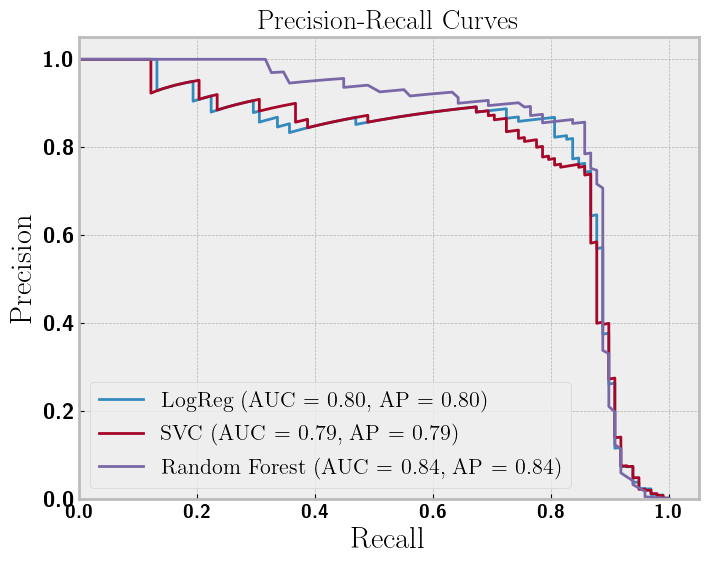

# Fraud Detection
Evan Frangipane

- [Dataset](#dataset)
- [Modeling](#modeling)
  - [Logistic Regression](#logistic-regression)
  - [Linear SVC](#linear-svc)
  - [Random Forest](#random-forest)
- [Model Comparison](#model-comparison)

## Dataset

We have a kaggle dataset on [credit card
fraud](https://www.kaggle.com/datasets/mlg-ulb/creditcardfraud). This is
a highly imbalaced dataset with fraud only $0.172\%$ of $284,807$
transactions.

This dataset is anonymized for personal privacy, so we have PCA
components as our features.

We calculate mutual information and correlation on our features to find
out what is interesting and predictive.

As our dataset is highly imbalanced we need to balance to model it. We
use SMOTEEN which oversamples and cleans at the same time. We have
created correlations between our features, so we use PCA to create new
features. The cumulative explained variance for our chosen $95\%$
explained variance is: $$
\begin{aligned}
  &[0.38926958, 0.48210123, 0.55026181, 0.60424607, 0.65694163, 0.69805992, \\
  &0.7356775,  0.77139423, 0.8014236,  0.82981687, 0.85601878, 0.87855404, \\
  &0.89891217, 0.91828968, 0.93316781, 0.9461651,  0.9563693 ]
\end{aligned}
$$ Our first component is very descriptive.

## Modeling

We choose three models to train: random forest, linear svc, and logistic
regression. We do both a grid search and random search for
hyperparameter tuning, with little difference in the results.

### Logistic Regression

Our logistic regression model used saga solver, L2 regularization with
strength (C) 100, and max iterations of 500.

| Class            | Precision | Recall | F1-Score | Support |
|------------------|-----------|--------|----------|---------|
| No fraud         | 1.00      | 0.98   | 0.99     | 56864   |
| Fraud            | 0.09      | 0.92   | 0.17     | 98      |
| **Accuracy**     |           |        | 0.98     | 56962   |
| **Macro Avg**    | 0.55      | 0.95   | 0.58     | 56962   |
| **Weighted Avg** | 1.00      | 0.98   | 0.99     | 56962   |

The logistic regression performed abysmally with fraud precision but
admirably with recall, resulting in a poor f1 score. We overestimated
the number of fraud cases.

### Linear SVC

Our linear SVC model user L2 regularization with strength (C) 10.

| Class            | Precision | Recall | F1-Score | Support |
|------------------|-----------|--------|----------|---------|
| No fraud         | 1.00      | 0.99   | 0.99     | 56864   |
| Fraud            | 0.11      | 0.92   | 0.19     | 98      |
| **Accuracy**     |           |        | 0.99     | 56962   |
| **Macro Avg**    | 0.55      | 0.95   | 0.59     | 56962   |
| **Weighted Avg** | 1.00      | 0.99   | 0.99     | 56962   |

The linear SVC performed abysmally with fraud precision but admirably
with recall, resulting in a poor f1 score. It was slightly better than
the logistic regression. Again, we overestimated the number of fraud
cases.

### Random Forest

Our random forest model had 200 estimators and no max depth.

| Class            | Precision | Recall | F1-Score | Support |
|------------------|-----------|--------|----------|---------|
| No fraud         | 1.00      | 1.00   | 1.00     | 56864   |
| Fraud            | 0.79      | 0.86   | 0.82     | 98      |
| **Accuracy**     |           |        | 1.00     | 56962   |
| **Macro Avg**    | 0.90      | 0.93   | 0.91     | 56962   |
| **Weighted Avg** | 1.00      | 1.00   | 1.00     | 56962   |

The random forest performed well in both precision and recall resulting
in a decent f1 score. Notably, the recall for fraud was worse than the
two previous models but the precision was much better.

## Model Comparison

We performed a precision-recall analysis and also computed the AUC and
average precision score for our three models.

The random forest performed better across the board as can be seen in
the plot. AUC and average precision were also best for the random forest
model.
