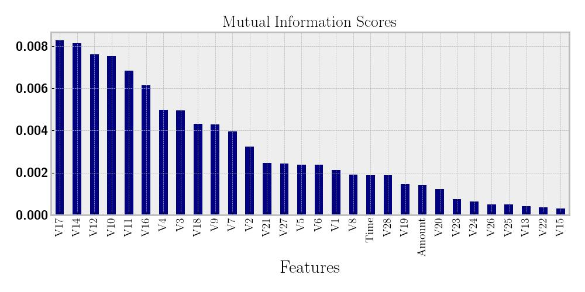
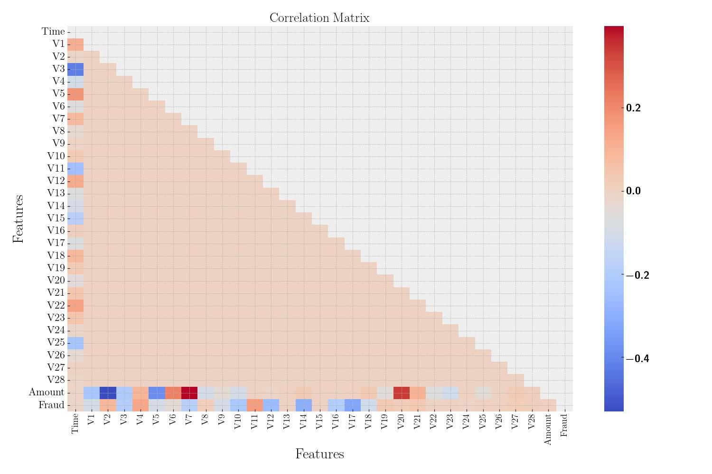
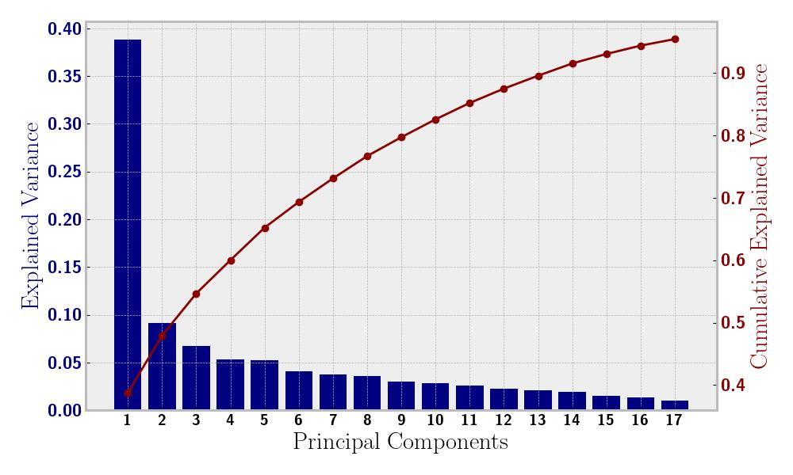
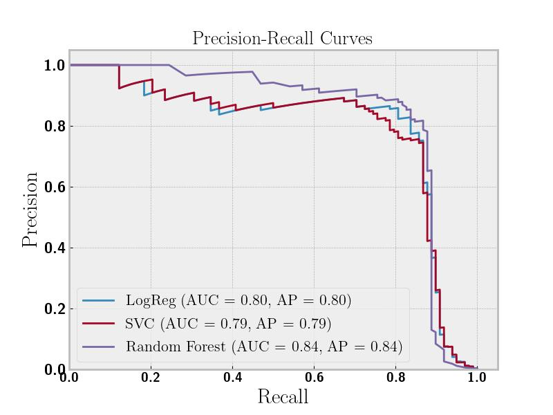

# Fraud Detection
Evan Frangipane

- [Goal](#goal)
- [Dataset](#dataset)
- [Modeling](#modeling)
  - [Logistic Regression](#logistic-regression)
  - [Linear SVC](#linear-svc)
  - [Random Forest](#random-forest)
- [Model Comparison](#model-comparison)

## Goal

The goal of this project is to classify credit card transactions as
fraud or non-fraud using machine learning. Two python notebooks are
utilized toward this goal with the
[first](https://github.com/evanfrang/fraud_detection/blob/main/fraud_eda.ipynb)
performing exploratory data analysis (EDA) and the
[second](https://github.com/evanfrang/fraud_detection/blob/main/fraud_pipeline.ipynb)
training and comparing machine learning models.

## Dataset

We have a kaggle dataset on [credit card
fraud](https://www.kaggle.com/datasets/mlg-ulb/creditcardfraud). This is
a highly imbalaced dataset with fraud only $490$ of $284,807$
transactions.

This dataset is anonymized for personal privacy, so we have PCA
components as our features.

We calculate mutual information and correlation on our features to find
out what is interesting and predictive. Mutual information is a measure
of how dependent the fraud feature is on all the other independent
features in the dataset.

Correlation is a measure of association between any two features in the
dataset and can be positive or negative.

As our dataset is highly imbalanced we need to balance it before running
our models. We use SMOTE which oversamples the fraud cases in our
training set. We have created correlations between our features, so we
use PCA to create new features that are uncorrelated.

Our new principal components computed for 95% explained variance:

As we can see from the plot our first component is very predicitive of
fraud. Also, we now have fewer dimensions in our dataset after PCA.

## Modeling

We choose three models to train: random forest, linear svc, and logistic
regression. We do a grid search for hyperparameter tuning of our models.
The dataset is split into 80% training data and 20% testing data. All
results are for model performance on the testing dataset.

### Logistic Regression

Our logistic regression model used L2 regularization with strength (C)
100.

| Class    | Precision | Recall   | F1-Score | Support |
|----------|-----------|----------|----------|---------|
| No fraud | 1.00      | 0.98     | 0.99     | 56864   |
| Fraud    | **0.10**  | **0.92** | **0.17** | 98      |

The logistic regression performed abysmally with fraud precision but
admirably with recall, resulting in a poor f1 score. A small precision
means our model found too many fraud cases (false positives).

### Linear SVC

Our linear SVC model used L2 regularization with strength (C) 10.

| Class    | Precision | Recall   | F1-Score | Support |
|----------|-----------|----------|----------|---------|
| No fraud | 1.00      | 0.99     | 0.99     | 56864   |
| Fraud    | **0.11**  | **0.92** | **0.19** | 98      |

The linear SVC performed abysmally with fraud precision but admirably
with recall, resulting in a poor f1 score. It was slightly better than
the logistic regression. Again, we overestimated the number of fraud
cases.

### Random Forest

Our random forest model had 200 trees and no max depth.

| Class    | Precision | Recall   | F1-Score | Support |
|----------|-----------|----------|----------|---------|
| No fraud | 1.00      | 1.00     | 1.00     | 56864   |
| Fraud    | **0.79**  | **0.86** | **0.82** | 98      |

The random forest performed well in both precision and recall resulting
in a decent f1 score. Notably, the recall for fraud was worse than the
two previous models but the precision was much better.

## Model Comparison

We performed a precision-recall analysis to compare our three models. We
used PR instead of receiver operating characteristic (ROC) because our
data is severely imbalanced and ROC can be too optimistic because of the
larger non-fraud class. PR is focused on the fraud class, so it is a
better measure for performance in this case.

The random forest performed better except at very high recall, as can be
seen in the plot. We also calculated the area under the curve (AUC) of
the PR curve and average precision, which were roughly equal for all
models. These also showed that random forest model performed better than
the other models.
